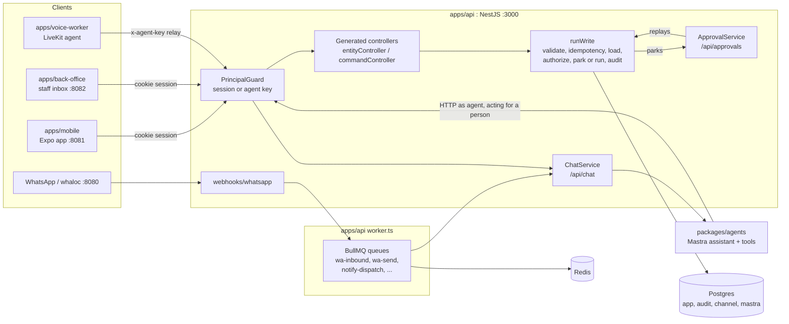

# Basecamp developer guide

**Basecamp is the agentic development stack for full-stack applications.** This guide is for developers who build a business on it. It covers how the pieces fit, where your code goes, the rules the framework enforces, and how to test and ship a feature.

To learn by doing, start with the tutorial, [Build a feature end to end: site visits](tutorial.md). It adds one feature through every layer, with tested code. Section 5 of this guide is the reference for the same steps.

Everything here describes the code as it is in this repository. File paths are relative to the repository root. If this guide and the code disagree, the code wins. Please fix the guide when that happens.

---

## 1. What this framework is

You declare your business once, in a typed spec: its records (entities), its multi-step actions (commands), who may do what, and what needs a person's approval. The framework builds the rest from that spec:

- REST routes, with validation and a list grammar (filters, search, sort, keyset pages).
- Tools for the assistant (`list-*`, `get-*`, `create-*`, `update-*`, `delete-*`, and one per command).
- Typed client methods and React data hooks for the app.
- Scoping by business (tenant), role and customer, on every read and write.
- Approvals: a write that needs a person's yes is parked, then replayed when someone approves it.
- An audit row for every write, refusal and decision.
- History lines, approval cards, and how the assistant shows results on screen, on WhatsApp and in speech.

The template ships with a sample domain: meetings, notes and to-dos. It shows every feature. You replace it with your own (see `DOMAIN.md` at the root).

### The three rules

These three rules explain almost every design choice in the codebase.

1. **One write path.** Every write goes through `runWrite` in `packages/core/src/write/pipeline.ts`: validate, idempotency, load, authorize, park or run, audit. That holds whether the write comes from the app, the assistant, WhatsApp, voice or an approval replay. No feature writes to the database any other way.
2. **The assistant is a user.** The assistant has no database access. Its tools call the same HTTP API the app calls, as an agent principal acting for a person (`x-agent-key`, `x-acting-for`). The same rules, scopes, approvals and audit apply. A dependency-cruiser rule (`agents-not-to-db`) keeps it that way.
3. **Channels are views.** The app, WhatsApp and voice all reach one chat service (`apps/api/src/modules/chat`) and one thread per person. A tool result carries a *present intent*, such as "show the `todo.list` view with this query". Each channel draws it in its own way: a component in the app, words and buttons on WhatsApp, a short sentence in voice.

---

## 2. How it fits together



Read the diagram like this:

- People call the API with a Better Auth session cookie. `PrincipalGuard` turns the request into a `Principal`: who is acting, for whom, in which business, with which roles.
- The assistant runs inside the API process (`ChatService` calls Mastra), but its tools go back out over HTTP to the same API, with agent headers. That round trip is on purpose: the assistant passes through every guard, rule and audit row.
- WhatsApp messages arrive at `POST /webhooks/whatsapp`. They are stored, queued, and processed by the queue worker (`apps/api/src/worker.ts`), which runs a chat turn and queues the reply.
- The voice worker is a *relay*: it may only start chat turns (`@RelayAllowed()` routes) for the person in the call.

### What a write does

Every write, from any caller, follows these steps in `runWrite`:

| Step | What happens | Where |
|---|---|---|
| Validate | `op.input.parse(rawInput)`, again, even after the controller parsed it | `pipeline.ts` |
| Idempotency | Same `idempotency-key` and same body returns the stored answer. Same key with a different body is a 409. | `app.idempotency` table |
| Load | `op.load(tx, p, input)` through scoped repos. A row that is not yours is a 404. | entity repo |
| Authorize | Returns `allow`, `deny` or `needs_approval` | `def.decide` or your command's `authorize` |
| Deny | The transaction rolls back. A `denied` audit row is written. The caller gets 403 `{ error: 'forbidden', rule, reason }`. | |
| Park | Inserts an `app.approvals` row and a `needs_approval` audit row. Returns `{ status: 'needs_approval', approval }`. | `approvals.ts` |
| Run | `op.run(...)` inside the transaction | your command or the entity repo |
| Audit | One row per touched record, plus one for a command | `audit.events` |
| Events | Published after commit by the CQRS handler | `NamedEvent` |

Every write answers a `WriteResult` (`packages/contracts/src/framework/write.ts`):

```ts
{ status: 'done', value } | { status: 'needs_approval', approval }
```

---

## 3. Where things live

### The domain: the folders you replace

The framework reads each of these only through its `index` file. The dependency-cruiser rule `framework-reads-the-domain-through-its-index` enforces this (`pnpm lint:deps`).

| Path | What lives there | You edit it when |
|---|---|---|
| `packages/contracts/src/domain/` | Zod schemas, `entitySpec`s, `commandSpec`s, and `domain = defineDomain({ name, entities, commands })` | You add or change a record, a field, a list filter, an approval rule or a command |
| `packages/db/src/schema/domain.ts` | Drizzle tables in the `app` schema | You add a table or a column |
| `packages/db/drizzle/` | Generated SQL migrations and `meta/_journal.json` | After `pnpm --filter @app/db generate --name <name>`. Never edit by hand. |
| `apps/api/src/domain/` | `defineEntity` / `defineCommand`, Nest modules, `access.ts`, and `DomainModule` in `index.ts` | You wire a new entity or command into the API, or change who sees what |
| `packages/notifications/src/domain/` | `domainTemplates` (`defineTemplate`) and `domainNotifications` (`defineNotification`) | Your business sends reminders or WhatsApp templates |
| `packages/ui-registry/src/domain/` | `uiDomain = { views, screens }` (`defineView`, `defineScreen`) | The assistant should show a record or a list in a new way |
| `packages/agents/src/domain/` | `agentDomain`: persona, rules, help, scripted-model scripts, eval cases | You teach the assistant your business, or add evals |
| `apps/mobile/src/domain/` | `appDomain = defineAppDomain({ tagline, nav, suggestions, bind })`, React components for your views, screens | You draw a view in the app or add nav items |
| `apps/mobile/src/app/(domain)/` | Expo Router routes for your screens. `index.tsx` is the home screen. | You add an app screen |
| `apps/api/test/domain/`, `packages/ui-registry/src/domain/*.test.ts` | Your domain's e2e and view tests | Always, with the feature |

### The framework: the folders you read

You should rarely need to change these. When you do, it is a framework change and needs its own tests.

| Path | What lives there |
|---|---|
| `packages/contracts/src/framework/` | `entitySpec`, `commandSpec`, `defineDomain`, the list grammar, present intents, `WriteResult` |
| `packages/contracts/src/platform/` | The framework's own entities (saved `pages`) and commands (`notify.send`, `handoff.request`) |
| `packages/contracts/src/catalog.ts` | `entities` and `commands`: domain plus platform. Tools, hooks and history read from here. |
| `packages/core/src/` | `defineEntity`, `defineCommand`, `runWrite`, `ApprovalService`, guards, controller factories, list SQL. `src/tools/` builds agent tools (imported as `@app/core/tools`). |
| `packages/policy/src/` | `accessFor`, `rowAllowed`, `DEFAULT_ACCESS`, `subjectOf`, `userIdOf` |
| `packages/db/src/schema/` | Tenancy, approvals, idempotency, audit, channel tables |
| `packages/agents/src/` | The Mastra assistant, profiles, the fake model, scorers, evals harness, Studio |
| `packages/ui-registry/src/` | `defineView`, `createRegistry`, platform views; `react.ts` for `bindView` / `bindScreen` |
| `packages/i18n/src/` | `LANGS`, `Labels`, the framework's phrases (`messages.ts`), date and plural formatting |
| `packages/channels/src/` | WhatsApp transport only: adapter, render, split, keywords, approval tokens |
| `packages/notifications/src/` | `defineTemplate`, `defineNotification`, quiet hours and marketing cap rules |
| `packages/api-client/src/` | `createApiClient`: `entity(spec)`, `command(spec, input)`, and typed calls for every framework route |
| `apps/api/src/channels/` | WhatsApp webhook, queues, sending, notifications dispatch, templates CLI, handoff, back office API, erasure |
| `apps/api/src/modules/` | Chat, threads, history, me, voice, pages |
| `apps/mobile/src/framework/`, `views/`, `chat/`, `canvas/` | Data hooks, `InlineView`, chat runtime, canvas store and `PageHost` |

### Import rules

`.dependency-cruiser.cjs` holds these rules. All are errors. CI runs `pnpm lint:deps`.

| Rule | What it means for you |
|---|---|
| `contracts-stays-a-leaf` | `@app/contracts` imports no other workspace package except `@app/i18n`, and no app. Keeping Node, Nest and Drizzle out of specs is a convention the rule does not enforce. (Compare `ui-registry-no-runtime`, which does list `react`, `@nestjs` and `drizzle-orm`.) |
| `i18n-is-a-leaf` | `@app/i18n` imports nothing at all. |
| `agents-not-to-db` | The assistant never imports `@app/db`. It reaches data through the API. |
| `core-not-to-mastra`, `core-tools-not-to-db` | Mastra is used only in `packages/core/src/tools/`, and those tools never touch the database. |
| `db-policy-not-to-mastra` | `db` and `policy` know nothing about the model. |
| `ui-registry-no-runtime` | View definitions import only contracts, i18n and the registry. React bindings live in `@app/ui-registry/react`. |
| `channels-is-transport`, `notifications-are-definitions` | These packages hold no database, queue, Nest or policy code. Sending and consent live in `apps/api`. |
| `voice-worker-is-a-client`, `back-office-is-a-client` | These apps talk to the API over HTTP only. |
| `packages-not-to-apps` | A package never imports an app. |
| `framework-reads-the-domain-through-its-index` | Outside a `domain/` folder, import domain code only through `domain/index.(ts|tsx|js)`. |

---

## 4. Your first hour

### Setup

You need Node 24 (`.nvmrc`), pnpm 12 (`packageManager` in `package.json`) and Docker.

```bash
pnpm install
cp .env.example .env
```

Fill these in `.env`. Each one must be at least 32 characters. Generate each with `openssl rand -hex 32`:

- `BETTER_AUTH_SECRET`
- `AGENT_API_KEY`
- `VOICE_AGENT_KEY` (must differ from `AGENT_API_KEY`; the API refuses to start otherwise, because audit tells them apart)
- `APPROVAL_SECRET` (signs WhatsApp approval buttons; without it approvals are decided in the app only)

To run without any model or speech keys, set:

```bash
MODEL_MODE=fake     # scripted assistant, no OPENROUTER_API_KEY needed
VOICE_MODE=fake     # voice worker takes text in, gives text out
```

Then start the services, build, migrate and run:

```bash
pnpm infra:up          # docker compose up -d: every service in compose.yaml
pnpm build             # the API's tests and CLIs run from dist/
pnpm db:migrate
pnpm templates:sync    # sends WhatsApp templates to whaloc; needs the build and whaloc
pnpm dev               # API + queue worker, mobile web, back office, voice worker
```

Check it is up:

```bash
curl http://localhost:3000/health     # {"ok":true}
```

Things that will trip you up:

- `pnpm dev` also starts the voice worker, which exits at startup if `VOICE_AGENT_KEY` is missing or short, or if `VOICE_MODE=live` has no `SARVAM_API_KEY` (`assertConfig()` in `apps/voice-worker/src/config.ts`). turbo then stops every dev task. `.env.example` ships `VOICE_AGENT_KEY=` empty and `VOICE_MODE=live`. Set `VOICE_AGENT_KEY` and `VOICE_MODE=fake`, or run `pnpm dev --continue`, or run `pnpm turbo run dev --filter=!@app/voice-worker`.
- With `MODEL_MODE=live` (the default in `.env.example`) and no `OPENROUTER_API_KEY`, chat answers 503 "Set OPENROUTER_API_KEY in .env to use the assistant".
- There is no `infra:down` script. Use `docker compose down`.
- `templates:sync` and `templates:check` run `apps/api/dist/channels/templates/cli.js`. Build first.
- Compose's Postgres runs `infra/postgres/init.sql` (postgis and pgcrypto extensions, and `ALTER ROLE app SET search_path = public`) only on a fresh volume. On any other Postgres, run it yourself before `pnpm db:migrate`, or Better Auth's tables land in the `app` schema.

### Local tools

| Tool | URL | What for |
|---|---|---|
| API | http://localhost:3000 | `GET /health`; `GET /me` shows the principal the API sees for you |
| Mobile app (web) | http://localhost:8081 | The product |
| Back office | http://localhost:8082 | Staff inbox for WhatsApp handoffs |
| Bull Board | http://localhost:3000/admin/queues | Queues. Sign in to the app as an owner or admin first. Not mounted in production. |
| whaloc | http://localhost:8080 | WhatsApp Cloud API emulator with a chat UI |
| Mailpit | http://localhost:8025 | Email sent by notifications |
| pgAdmin | http://localhost:5050 | `admin@example.com` / `admin`; server `app` (host `postgres`, user `app`) is preregistered |
| Mastra Studio | http://localhost:4000 | Try the assistant and its tools: `pnpm --filter @app/agents studio` (needs the API running) |
| LiveKit | ws://localhost:7880 | Voice rooms (dev keys `devkey` / `secret`) |
| MinIO | http://localhost:9001 | Runs in compose, but no code uses it yet |

Postgres is on `localhost:5432` (`app` / `app` / `app`). Redis is on `localhost:6379`.

### One feature on three channels

The sample to-do shows the whole loop. Try it before you write any code.

**1. The app.** Open http://localhost:8081, sign up, and add a to-do on the To-dos screen. That is `POST /api/todos` through `useEntityMutation('todos')`.

**2. The assistant in the app.** In the chat, type `add Call the plumber`, then `delete Call the plumber`. With `MODEL_MODE=fake` the scripted model calls `create-todo`, then `list-todos` and `delete-todo`. The delete is parked, because the spec says so:

```ts
// packages/contracts/src/domain/todo.ts
// An agent never deletes without the person.
approval: { delete: (p) => p.actor.kind === 'agent' },
```

An approval card appears in the chat. Approve it, and the to-do is gone.

**3. The raw API.** The same calls, as a person:

```bash
# Sign up. Better Auth wants a trusted Origin.
curl -c jar -H 'origin: http://localhost:8081' -H 'content-type: application/json' \
  -d '{"name":"Ana","email":"ana@example.com","password":"password123"}' \
  http://localhost:3000/api/auth/sign-up/email

curl -b jar -H 'content-type: application/json' -d '{"title":"Order tiles"}' \
  http://localhost:3000/api/todos
# {"status":"done","value":{"id":"…","title":"Order tiles","done":false,…}}

curl -b jar 'http://localhost:3000/api/todos?done=false&sort=-createdAt'
# {"items":[…],"nextCursor":null}
```

**4. WhatsApp.** The business number must be claimed by your tenant before inbound messages are handled. Otherwise the inbound processor marks them `unknown number`:

```bash
curl -b jar -H 'content-type: application/json' -d '{}' \
  http://localhost:3000/api/channels/whatsapp/number
```

Then open whaloc at http://localhost:8080 and write to the seeded number (+91 80 4000 0100) from a new phone number. You are a customer of the business now. Write `list`. The reply is the `todo.list` view's `text`, sent as WhatsApp words. You see only your customer's rows, which is none yet. To act as yourself on WhatsApp, link your number in the app (the app calls `POST /api/channels/whatsapp/code`, then `POST /api/channels/whatsapp/verify`).

### Find yourself in the audit log

Every write you just made is in `audit.events`. Open pgAdmin or `psql` and run:

```sql
SELECT at, action, outcome, actor_kind, actor_id, acting_for, channel, rule, reason, run_id
FROM audit.events
ORDER BY at DESC
LIMIT 20;
```

You will see `todo.create` rows with `actor_kind = 'user'`, the agent's `todo.delete` with `outcome = 'needs_approval'`, then `approval.approved` and the replayed `todo.delete` with `approved_by` set to you.

To follow one assistant turn, take the `x-run-id` response header from `/api/chat` (or `runId` from `/api/chat/once`):

```sql
SELECT at, action, outcome, actor_kind, acting_for, rule, reason, before, after
FROM audit.events WHERE run_id = '<run-id>' ORDER BY at;

SELECT id, action, status, summary, approver_user_id, approver_roles, expires_at, failure_reason
FROM app.approvals WHERE run_id = '<run-id>';
```

To see what an approval replay did, find rows that share the approve call's request id:

```sql
SELECT at, action, outcome, actor_kind, approved_by, rule FROM audit.events
WHERE request_id = (SELECT request_id FROM audit.events
                    WHERE action = 'approval.approved' AND resource_id = '<approval-id>')
ORDER BY at;
```

The app shows the same data per record through `GET /api/history?resourceType=todo&resourceId=<id>`.

---

## 5. Declaring your domain

Work in this order:

1. The spec (contracts)
2. The table (db)
3. The migration
4. `defineEntity` / `defineCommand` (api)
5. A Nest module
6. Add it to `DomainModule`
7. Views, app bindings, assistant scripts, notifications (as needed)

### 5.1 The entity spec

`entitySpec` lives in `packages/contracts/src/framework/spec.ts`. You give it the parts below. It fills `plural` (`${name}s`), `pascal`, `expose` (every action `'all'`, merged with yours) and `approval` (`{}`).

| Field | Meaning |
|---|---|
| `name` | Singular, lower case. Used in routes, command names (`todo.create`), tool ids and audit `resource_type`. |
| `plural`, `pascal` | Derived unless you give them. Give `plural` when "s" is wrong. |
| `label` | How people say it ("to-do"). Used in messages such as `No such to-do`. |
| `fieldLabels` | `{ field: { en, hi, te } }`. Field names in the approval preview. |
| `description` | Goes into tool descriptions. Write it for the model. |
| `schemas` | `{ read, create, update }`, all `z.object(...)` |
| `list` | The list grammar config (see 5.6) |
| `expose` | Per action: `'all'`, `'human'` or `'internal'` (see 5.7) |
| `approval` | Per write action: when it parks and who decides (see 5.8) |
| `views` | `{ list?, item? }`: registered view names the tools present results with |

The sample to-do:

```ts
// packages/contracts/src/domain/todo.ts
export const TodoSpec = entitySpec({
  name: 'todo',
  label: 'to-do',
  description: "The user's to-dos: short tasks with an optional due date, optionally linked to a meeting.",
  schemas: { read: Todo, create: CreateTodoInput, update: UpdateTodoInput },
  fieldLabels: { title: { en: 'Title', hi: 'शीर्षक', te: 'శీర్షిక' }, /* … */ },
  list: {
    filterable: { done: 'boolean', dueOn: 'date', meetingId: 'id', title: 'text' },
    sortable: ['dueOn', 'createdAt', 'title'],
    defaultSort: [['createdAt', 'asc']],
    search: ['title'],
    pageSize: { default: 50, max: 100 },
    examples: { done: 'false', dueOn: '{ "lte": "2026-10-31" }', /* … */ },
  },
  // An agent never deletes without the person.
  approval: { delete: (p) => p.actor.kind === 'agent' },
  views: { list: 'todo.list', item: 'todo.item' },
});
```

Update schemas in the sample refuse an empty patch:

```ts
.refine((v) => Object.values(v).some((x) => x !== undefined), 'Send at least one field to change')
```

Read schemas can use the exported `CreatedBy = z.enum(['person', 'assistant'])`.

Register the spec in `packages/contracts/src/domain/index.ts`. The key must be the plural, or `defineDomain` throws at load:

```ts
export const domain = defineDomain({
  name: 'Meetings',
  entities: { todos: TodoSpec, notes: NoteSpec, meetings: MeetingSpec },
  commands: [CloseMeetingSpec, RescheduleMeetingSpec],
});
```

### 5.2 The table

Add tables to `packages/db/src/schema/domain.ts`, in the `app` schema. Use the helpers from `schema/base.ts` and `schema/tenancy.ts`:

```ts
export const todos = app.table('todos', {
  id: id(),
  tenantId: tenantColumn(),
  ownerId: text('owner_id').notNull().references(() => user.id),
  customerId: customerColumn(),
  title: text('title').notNull(),
  done: boolean('done').default(false).notNull(),
  dueOn: date('due_on'),
  meetingId: text('meeting_id').references(() => meetings.id, { onDelete: 'set null' }),
  createdBy: text('created_by', { enum: ['person', 'assistant'] }).notNull().default('person'),
  createdAt: timestamp('created_at', { withTimezone: true }).defaultNow().notNull(),
  updatedAt: timestamp('updated_at', { withTimezone: true }).defaultNow().$onUpdate(() => new Date()).notNull(),
}, (table) => [
  index('todos_owner_id_idx').on(table.ownerId),
  index('todos_tenant_customer_idx').on(table.tenantId, table.customerId),
]);
```

What the framework requires:

- JS keys named exactly `id` and `tenantId`, plus an owner column. Otherwise `defineEntity` throws `<name>: table needs id, tenantId and owner columns`.
- Owner and customer columns can have any key. You point at them with a function.
- `createdBy` is optional. If it exists, the framework sets it to `'assistant'` for an agent and `'person'` otherwise.
- Every field named in `list` must be a column key, or the list query throws `List config names "x", which is not a column`.
- Entity routes use `ParseUUIDPipe` for `:id`, so ids must be UUIDs. `id()` gives `gen_random_uuid()::text`.

Then generate and apply the migration:

```bash
pnpm --filter @app/db generate --name <your-change>
pnpm db:migrate
```

`drizzle.config.ts` only manages the `public`, `app`, `audit` and `channel` schemas. Mastra owns `mastra` and `mastra_obs`.

### 5.3 defineEntity

`defineEntity` (`packages/core/src/entity/define-entity.ts`) joins the spec to its table:

```ts
// apps/api/src/domain/todos/todo.entity.ts
export const Todo = defineEntity(TodoSpec, {
  table: todos,
  owner: (t) => t.ownerId,
  customer: (t) => t.customerId,
  access: BUSINESS_ACCESS,
});
```

| Option | Meaning |
|---|---|
| `table` | The Drizzle table |
| `owner` | The owner column. Used for `'own'` access, and set on create. |
| `customer` | The customer column, for `'customer'` access. Optional. |
| `access` | Who reaches which rows (see 6.2). Defaults to `DEFAULT_ACCESS`. |
| `rules` | `EntityRule[]`: domain checks on writes |
| `summarize` | `(action, input, row) => string`: the approval card text. The default uses `title`: `Delete "Call the plumber"`. |
| `events` | Publish `<entity>.created/updated/deleted` after commit. Default `true`. |

An entity rule has this shape:

```ts
type EntityRule<T> = (p, action, row, input, ctx: { via: 'crud' | string }) => AuthorizeResult | null;
```

Return `deny(rule, reason)` to refuse, or `null` to pass. `ctx.via` is `'crud'` for a plain route, or the command's name when a command calls the repo. The meeting uses that to force closing through its command:

```ts
// apps/api/src/domain/meetings/meeting.entity.ts
(_p, action, _row, input, ctx) =>
  action === 'update' && input?.status === 'closed' && ctx.via !== 'meeting.close'
    ? deny('use_close_meeting', 'Close a meeting with close-meeting, so its summary and to-dos are written')
    : null,
```

The returned `EntityDef` has a scoped `repo` for use inside commands: `get`, `find`, `list`, `insert`, `update` and `delete`. Every query is limited to the principal's tenant and grants. Someone else's id is a 404. Writes re-parse the input, run the rules, and strip `id`, owner, `createdBy`, `tenantId` and customer from the input.

### 5.4 Commands

Use a command when one action touches several records, or has rules a plain update cannot express. Declare it in contracts:

```ts
// packages/contracts/src/domain/commands.ts
export const CloseMeetingSpec = commandSpec({
  name: 'meeting.close',
  description: 'Close a meeting in one step: …',
  input: CloseMeetingInput,
  output: CloseMeetingResult,
  http: { method: 'POST', path: '/api/meetings/:meetingId/close' },
  tool: 'close-meeting',
  expose: 'all',
  approvalNote: 'When you call it, the whole close waits for the user to approve it.',
  view: { name: 'meeting.card', id: (input) => input.meetingId },
  verb: { do: 'close', did: 'closed' },
  touches: ['meeting', 'note', 'todo'],
});
```

| Field | Meaning |
|---|---|
| `name` | Dotted, as audited |
| `http` | Method and path. Path params (`:meetingId`) come from the input. The rest is the body. |
| `tool` | The agent's tool id. Leave it out to keep the command off the agent. |
| `expose` | `'all'` or `'human'`. There is no `'internal'` for commands. |
| `approvalNote` | Added to the tool description |
| `view` | What the tool result shows |
| `verb` | Words for approval cards and history ("Approve close", "closed it") |
| `touches` | Entity names the app refreshes after the command runs |

Then implement it in the API with `defineCommand` (`packages/core/src/command/define-command.ts`):

```ts
// apps/api/src/domain/meetings/close-meeting.command.ts
export const CloseMeeting = defineCommand(CloseMeetingSpec, {
  resource: { type: 'meeting', id: (input) => input.meetingId },
  load: (tx, p, input) => Meeting.repo.get(tx, p, input.meetingId), // scoped: 404 if not theirs
  authorize: (p, meeting) => {
    if (meeting.status === 'closed') return deny('already_closed', 'This meeting is already closed');
    if (p.actor.kind === 'agent') return needsApproval('agent_close', 'Closing a meeting needs your approval');
    return allow('owner_closes');
  },
  summarize: (input, meeting) =>
    `Close ${meeting.title} with 1 note and ${todosLabel(input.actionItems.length)}`,
  run: async ({ tx, principal, input, loaded: meeting, via }) => {
    const note = await Note.repo.insert(tx, principal, { /* … */ meetingId: meeting.id }, via);
    // … Todo.repo.insert(tx, principal, { ...item, meetingId: meeting.id }, via) for each item
    const closed = await Meeting.repo.update(tx, principal, meeting, { status: 'closed' }, via);
    return {
      value: { meeting: closed, note, todos },
      touched: [{ type: 'meeting', id: meeting.id, change: 'updated', before: meeting, after: closed }, /* … */],
      events: [new MeetingClosed(closed, note, todos)],
    };
  },
});
```

Points to keep in mind:

- Always pass `via` to repo calls. Entity rules see it as `ctx.via`.
- Every record you change goes into `touched`. Each entry becomes an audit row.
- `authorize` alone decides whether a command parks. The optional `approval` config (`{ by, channels, minAssurance }`) only says who decides.
- A domain event is a class that implements `NamedEvent` (`eventName` and `row`). Notifications can schedule on it:

```ts
export class MeetingClosed implements NamedEvent {
  readonly eventName = 'meeting.closed';
  get row() { return this.meeting; }
  constructor(readonly meeting: unknown, readonly note: unknown, readonly todos: unknown[]) {}
}
```

### 5.5 Nest wiring

The controller and handler factories live in `packages/core/src/http/controller-factory.ts` and `entity/handlers.ts`:

```ts
// apps/api/src/domain/meetings/meetings.module.ts
@Module({
  controllers: [entityController(Meeting), commandController(CloseMeeting), commandController(RescheduleMeeting)],
  providers: [...entityHandlers(Meeting), commandHandler(CloseMeeting), commandHandler(RescheduleMeeting)],
})
export class MeetingsModule {}

// apps/api/src/domain/index.ts
@Module({ imports: [TodosModule, NotesModule, MeetingsModule] })
export class DomainModule {}
```

That gives you:

| Route | Status |
|---|---|
| `GET /api/<plural>` | list, with the list grammar |
| `GET /api/<plural>/:id` | get |
| `POST /api/<plural>` | create, 201 |
| `PATCH /api/<plural>/:id` | update |
| `DELETE /api/<plural>/:id` | delete |
| `spec.http.method spec.http.path` | the command, 200 |

`entityHandlers` and `commandHandler` also register each op for approval replay. You need both the controller and the handler. A controller without its handler has nothing to run, and a parked op without its handler fails as "can no longer be replayed".

### 5.6 The list grammar

`ListConfig` (`packages/contracts/src/framework/list.ts`):

| Field | Meaning |
|---|---|
| `filterable` | `{ field: FieldType }`, where the type is one of `'enum'`, `'date'`, `'text'`, `'number'`, `'boolean'`, `'id'` |
| `sortable` | Fields you may sort by |
| `defaultSort` | `[[field, 'asc' \| 'desc'], …]` |
| `search` | Columns matched by `q`, case-insensitive, OR-ed. Without it there is no `q`. |
| `pageSize` | `{ default, max }` for HTTP |
| `toolPageSize` | The agent tool's maximum rows. Default 20. |
| `examples` | Shown in the tool description |

Operators by type:

| Type | Operators |
|---|---|
| `enum`, `id` | `eq`, `ne`, `in` |
| `boolean` | `eq`, `ne` |
| `text` | `eq`, `ne`, `in`, `contains` |
| `date`, `number` | `eq`, `ne`, `in`, `lt`, `lte`, `gt`, `gte` |

The same filter in its two forms:

```text
HTTP:  GET /api/todos?done=false&dueOn[lte]=2026-10-31&sort=-dueOn&limit=20
JSON:  { done: false, dueOn: { lte: '2026-10-31' }, sort: '-dueOn', limit: 20 }
```

- The JSON form is what tools and `repo.list` take. `toQueryString(input)` turns it into the HTTP form.
- `in` takes a comma list over HTTP.
- `count: true` adds `total`.
- Unknown fields or operators are a 400. That is on purpose.

The response is `{ items, nextCursor, total? }`. Pagination is keyset: pass `nextCursor` back as `cursor`. A cursor from a different sort is a 400 `cursor_sort_mismatch`. Sorting on a nullable column works only for dates, timestamps and numbers. A nullable text or enum column in `sortable` passes load-time checks, then throws `Sorting on nullable ... is not supported` (`packages/core/src/query/list-grammar.ts`) on the first request that sorts by it, which the client sees as a 500. Keep such columns `notNull()` or out of `sortable`.

### 5.7 Expose: who can reach an action

| `expose` | HTTP route | Agent tool | Use it for |
|---|---|---|---|
| `'all'` | yes | yes | The default |
| `'human'` | yes, with `HumanOnlyGuard` | no, and an agent call is denied `humans_only` | Irreversible actions. The meeting's `delete` is `'human'`. |
| `'internal'` | no | no | Records only commands should write, through `def.repo` |

For commands, `'human'` gives a people-only route. To keep a command off the agent, leave out `tool`.

### 5.8 Approvals: when a write parks

On an entity spec, `approval[action]` decides whether a write parks:

```ts
type ApprovalRule =
  | 'always' | 'never'
  | ((p: Principal) => boolean)
  | { when?: 'always' | ((p) => boolean); by?: TenantRole[] | 'self'; channels?: Channel[]; minAssurance?: Assurance };
```

- The function form is the common one: `(p) => p.actor.kind === 'agent'`.
- The object form also says who decides and where. For example, `{ when: (p) => p.actor.kind === 'agent', by: ['owner', 'admin'], channels: ['app'] }`. `channels: ['app']` keeps an irreversible decision off WhatsApp buttons. No sample entity uses the object form yet. The one real example is a command: `approval: { by: ['owner', 'admin'] }` in `apps/api/src/channels/notify/send-template.command.ts`.

Who decides, when `by` is not set: the person the request is for, if they are a user and not only a customer. Otherwise, the business's `owner` and `ops`.

Approvals expire after 24 hours by default (`CoreModule.forRoot({ approvalTtlMs })`). Expiry is checked when someone tries to decide.

---

## 6. Principals and policy

### 6.1 The principal

Every request becomes a `Principal` (`packages/contracts/src/principal.ts`). The important fields:

| Field | Meaning |
|---|---|
| `actor` | `{ kind: 'user' \| 'agent', id, role }`. `role` is deprecated; use `roles`. |
| `actingFor` | For an agent: the person it acts for |
| `subject` | Whose business this is: `{ kind: 'user', userId }` or `{ kind: 'contact', contactId }`. Set by the server only. |
| `tenantId`, `roles`, `customerId` | The business, your roles in it, and your customer record if you are one |
| `assurance` | `'whatsapp_number'` (a number alone) or `'session'` (signed in) |
| `channel` | `'app'`, `'voice'` or `'whatsapp'` |
| `runId`, `agentVersion` | Set on agent calls, and written to audit |
| `approvedBy` | Set on an approval replay |

Everything comes from server data. Headers only choose: `x-tenant-id` picks among the businesses you belong to, and a WhatsApp channel lowers assurance. Sign-up creates the person's own business, with them as `owner` (a Better Auth `user.create.after` database hook in `apps/api/src/infra/auth.ts`). If that failed, `PrincipalGuard` creates it on their first call (`ensureDefaultTenant`).

A WhatsApp customer who has not linked an account acts as `actor.kind: 'user'` with id `contact:<id>`, roles `['customer']`.

Read `p` in your rules with the helpers in `@app/policy`: `subjectOf(p)`, `userIdOf(p)`, `subjectKeyOf(p)`.

### 6.2 Access

`Access` (`packages/policy/src/access.ts`) says, per role, which rows a read or write reaches:

| Grant | Rows |
|---|---|
| `'own'` | `owner = you`. Only for a user subject. |
| `'customer'` | `customer_id = your customer`. Only when you are a customer. |
| `'tenant'` | Every row in the business |

The sample's rules:

```ts
// apps/api/src/domain/access.ts
export const BUSINESS_ACCESS: Access = {
  read:  { owner: 'own', admin: 'tenant', ops: 'tenant', staff: 'own', customer: 'customer' },
  write: { owner: 'own', admin: 'tenant', ops: 'tenant', staff: 'own', customer: 'customer' },
};
```

Ask for a signed-in session on a write with `{ grant: 'customer', minAssurance: 'session' }`. A WhatsApp-only customer is then refused with rule `needs_assurance`.

When a customer creates a row, the row is owned by the business's default owner (`tenants.default_owner_id`) and gets the customer's id.

### 6.3 The order of checks on an entity write

`def.decide` checks in this order. The first one that refuses wins.

1. Write access needs more assurance: deny `needs_assurance`.
2. No grant, or the row is outside your grants: deny `no_access`.
3. An agent, and the action is not exposed `'all'`: deny `humans_only`.
4. Your entity `rules`: the first deny wins.
5. `spec.approval[action]` parks: `needs_approval`, rule `<name>_<action>_needs_approval`.
6. Otherwise allow, rule `scoped_access`.

---

## 7. The assistant and how it shows things

### 7.1 Tools come from specs

You do not write tools for entities or commands. `toolsFor` in `packages/core/src/tools` builds them from `entities` and `commands` in the catalog:

| Spec | Tools |
|---|---|
| Entity, action exposed `'all'` | `list-<plural>`, `get-<name>`, `create-<name>`, `update-<name>`, `delete-<name>` |
| Command with `tool` and `expose: 'all'` | `spec.tool` |
| Profile `app` only | `canvas-open`, `canvas-compose`, `canvas-patch` |

Tool descriptions are built from the spec's `description`, the list grammar and `examples`. A tool whose write would park says so in its description.

A tool never throws a refusal at the model. It returns `{ ok: false, status, error }` and the model explains it.

### 7.2 Teaching the assistant your business

Edit `packages/agents/src/domain/index.ts`:

```ts
export const agentDomain: AgentDomain = {
  persona: 'You are a meetings assistant. You help the user plan meetings, keep notes, and track action items.',
  rules: [ /* domain rules, one sentence each */ ],
  help: 'I can add, list, complete or delete to-dos, show today, and close or move meetings.',
  scripts: domainScripts,
  evalCases,
  voiceEvalCases,
  evalSetup: async (api) => { await api('POST', '/api/meetings', { /* … */ }); },
};
```

The framework adds its own rules before yours (`FRAMEWORK_RULES` in `packages/agents/src/version.ts`). Among them: look up before you change, never invent ids, and do not retry after a refusal.

### 7.3 The scripted model

With `MODEL_MODE=fake`, `fakeModel` in `packages/agents/src/fake/engine.ts` answers with scripts instead of an LLM. Tests, evals and CI use it. A script matches the user's text, calls a tool, and then speaks once the result is back:

```ts
// packages/agents/src/domain/scripts.ts
defineScript({
  name: 'add',
  match: (text) => command(VERBS.add, text),
  step: (title, turn) => {
    const r = turn.result('create-todo');
    if (!r) return [call('create-todo', { title })];
    const added = (t: { title: string }) =>
      ({
        en: `Added ${quoted(t.title)}.`,
        hi: `${quoted(t.title)} जोड़ दिया।`,
        te: `${quoted(t.title)} జోడించాను.`,
      })[turn.lang];
    return [say(written(r, added, turn))];
  },
}),
```

`VERBS`, `command` and `quoted` are local helpers in `packages/agents/src/domain/scripts.ts`, not exports. Put new scripts in that file, or copy the helpers.

Helpers you will use: `call`, `say`, `sayIn(turn, { en, hi, te })`, `verbs(...)`, `items(outcome)`, `written(...)`.

The fake model reads the language, surfaces and canvas from the system prompt with regular expressions. If you change the wording of `INSTRUCTIONS` in `version.ts`, scripted tests can break silently.

### 7.4 Views and present intents

A tool result carries a `present` intent (`packages/contracts/src/framework/present.ts`): `inline`, `open`, `page`, `patch` or `text`. Each channel draws it differently:

| Surface | Where | What it draws |
|---|---|---|
| `inline` | App chat | The view's bound React component |
| `canvas` | App, wide pane | Screens and saved pages of blocks |
| `text` | WhatsApp | `view.text(props, ctx)`, with buttons or lists for choices |
| `speech` | Voice | `view.speak(props, ctx)` |

Define a view in `packages/ui-registry/src/domain/`:

```ts
export const TodoListView = defineView({
  name: 'todo.list',
  description: '…', // the agent reads it; say when not to use it
  surfaces: ['inline', 'canvas', 'text', 'speech'],
  props: z.object({ title: z.string().max(60).optional(), items: z.array(Todo) }),
  source: { entity: TodoSpec, into: 'items' }, // fetched by query; the agent never writes `items`
  actions: { toggle },                         // action<Todo>({ command: 'todo.update', args: (t) => ({ id: t.id, done: !t.done }) })
  labels,                                      // { title, empty } as { en, hi, te }; noun as { en: ['to-do', 'to-dos'], hi: [...], te: [...] }
  text: (p, ctx) => /* WhatsApp words */,
  speak: (p, ctx) => spokenList(p.items.map((t) => t.title), labels, ctx),
});
```

Add it to `uiDomain.views`. `createRegistry` refuses a spoken list view without `labels.noun` and `labels.empty`.

Bind it to a component in the app, in `apps/mobile/src/domain/bindings.tsx`:

```ts
bindView(TodoListView, TodoListComponent);
```

The component gets the props, plus `act(actionName, item)` and `words`:

```tsx
export function TodoListComponent({ title, items, act, words }: ViewProps<typeof TodoListView>) {
  return (
    <ViewCard title={title ?? words.title} count={items.length}>
      <Rows items={items} empty={words.empty}>
        {(t) => <TodoLine todo={t} onToggle={() => act('toggle', t)} />}
      </Rows>
    </ViewCard>
  );
}
```

`act` runs through `useAct`. It calls the entity or the command as the person, shows a toast when a write is parked, and refreshes queries.

---

## 8. Channels, notifications and voice

### 8.1 WhatsApp

You do not write WhatsApp code for a feature. Inbound messages become chat turns on the `text` surface. Your views' `text` decides the words. Approvals become signed buttons when `APPROVAL_SECRET` is set and the approver is the person writing. The framework handles keywords (STOP, START, HELP, talk to a person, delete my data, link my account) in English, Hindi and Telugu, plus consent, the 24-hour window, handoff to a person and erasure.

### 8.2 Templates and notifications

Anything your business sends on its own goes through a template and a notification, declared in `packages/notifications/src/domain/index.ts`:

```ts
export const MeetingReminder = defineTemplate({
  name: 'meeting_reminder_v1',
  category: 'utility',
  params: z.object({ title: z.string().max(60), time: z.string().max(60) }),
  body: {
    en: 'Reminder: {{title}} at {{time}}.',
    hi: 'रिमाइंडर: {{title}} {{time}} पर है।',
    te: 'రిమైండర్: {{title}} {{time}}కి ఉంది.',
  },
  buttons: [{ type: 'quick_reply', id: 'snooze_15', text: { en: 'Snooze 15 min', hi: '15 मिनट बाद', te: '15 నిమిషాల తర్వాత' } }],
  example: { title: 'Site visit', time: '4:30 pm' },
});
```

`defineTemplate` checks the template when it loads:

- The name must match `/^[a-z][a-z0-9_]*_v\d+$/`.
- Every language needs a body, and each body's `{{placeholders}}` must equal the param keys.
- At most three quick replies.
- A marketing template needs an opt-out button or footer.
- The example must parse.

`defineNotification` says when, to whom and on which channels:

| Field | Meaning |
|---|---|
| `key` | e.g. `'meeting.reminder'` |
| `topic` | `'service'`, `'reminders'` or `'marketing'` (consent and quiet hours follow the topic) |
| `schedule` | `{ on: [events], at: (row) => Date \| null, cancelOn?: [events] }` |
| `send` | `{ on: [events] }`: send now |
| `when` | `(row) => boolean`: checked at send time |
| `to` | `(row) => [{ userId } \| { customerId } \| { contactId } \| { roles }]` |
| `channels` | Fallback order, e.g. `['whatsapp', 'email']` |
| `whatsapp` | `{ template, params(row, reader) }`. Required, even for email-only. |
| `email` | `{ subject, body }`. Required when `'email'` is in `channels`. |
| `onButton` | `{ [buttonId]: (row) => { reschedule?: Date; reply?: Labels } \| undefined }` |
| `approval` | `(row) => approvalId`: the quick replies `approve` and `reject` decide that approval |
| `dedupe` | Required. `(row) => string`: one pending schedule per key |

Event names are `<entity>.created|updated|deleted`, your commands' `NamedEvent`s, and `approval.requested` / `approval.decided`.

Add the template and notification to `domainTemplates` and `domainNotifications`. Then run:

```bash
pnpm build
pnpm templates:sync     # creates new templates at the provider (whaloc locally)
pnpm templates:check    # passes once every template a notification uses is approved in English
```

Never edit an approved template's words. `templates:sync` fails with "bump the version". Make `_v2` instead.

The usual way to send is an event plus `schedule` or `send.on`. `NotifyService.notify(def, row, tx)` (`apps/api/src/channels/notify/notify.service.ts`) is an instance method for Nest providers; a `defineCommand` `run` gets only `{ tx, principal, input, loaded, via }` and has no service to call. To send from inside a command, insert into the outbox with the command's transaction, as `apps/api/src/channels/notify/send-template.command.ts` does:

```ts
await tx.insert(schema.outbox).values({
  tenantId: principal.tenantId ?? '',
  key: def.key,
  payload: { row, dedupe: def.dedupe(row) },
});
```

Either way the send is part of the write, so a rollback sends nothing. The outbox relay runs only in the queue worker, or in the API with `WORKER_INLINE=1`.

### 8.3 Voice

Voice is a framework channel. The worker (`apps/voice-worker`) calls `/api/chat` as a relay for the person in the call. Surfaces are forced to `['inline', 'canvas', 'speech']`. A feature needs only:

- `speak` on its views.
- `labels` with `noun` and `empty` on spoken lists.
- Optionally `voiceEvalCases`.

---

## 9. Languages

The product speaks English, Hindi and Telugu (`LANGS` in `packages/i18n/src/lang.ts`). `Labels` is `Readonly<Record<Lang, string>>`, so a missing translation does not compile.

| Words | Where they go |
|---|---|
| Framework phrases ("Waiting for your approval") | `packages/i18n/src/messages.ts`: add the key to `en`, `hi` and `te`. The test checks the placeholders match. |
| View titles, empty lines, nouns | View `labels` |
| Field names in approval previews | Entity `fieldLabels` |
| Scripted answers | `sayIn(turn, { en, hi, te })`, and `VERBS` with `verbs(...)` |
| Template bodies | `defineTemplate` `body` |

Some app copy is still English only: toasts in `useAct`, tool-line labels in `ToolPart`, and the `text` of `approval.card` and `kpi.row`.

---

## 10. Recipes: how do I…

**…add a field to an existing entity?**
Add it to the read, create and update schemas. Add the column to the table. Run `pnpm --filter @app/db generate --name <change>` and `pnpm db:migrate`. If people filter on it, add it to `list.filterable`, and to `list.examples` so the assistant learns it. Add a `fieldLabels` entry.

**…add an entity?**
Follow section 5.

**…make the assistant ask before it does something?**
On an entity, set `approval: { <action>: (p) => p.actor.kind === 'agent' }` on the spec. On a command, return `needsApproval('<rule>', '<reason>')` from `authorize`.

**…make something people-only?**
On an entity, set `expose: { delete: 'human' }`. On a command, set `expose: 'human'`, or leave out `tool`.

**…enforce a business rule ("a closed meeting cannot reopen")?**
Add an entity `rule` that returns `deny(rule, reason)`. It runs on every path, including inside commands. Use `ctx.via` to allow a path only through one command.

**…let ops and admins see the whole business?**
Give the entity `access` with `'tenant'` for those roles, like `BUSINESS_ACCESS`.

**…let customers reach their own rows from WhatsApp?**
Add `customerColumn()` to the table, pass `customer: (t) => t.customerId` to `defineEntity`, and give the `customer` role the `'customer'` grant.

**…read other records inside a command?**
Use `OtherEntity.repo.get(tx, p, id)` or `OtherEntity.repo.list(tx, p, { …filters, limit: 100 })`. Both are scoped. Inside a command `list` allows up to 1000 rows.

**…change how a result looks in chat, on WhatsApp or in speech?**
Change the view's component (app), its `text` (WhatsApp) or its `speak` (voice). Point the spec's `views` or the command's `view` at it.

**…send a reminder?**
Define a template and a notification (section 8.2), then run `templates:sync`.

**…call the API from a script or another service?**
Use `createApiClient({ baseUrl, headers: () => ({ cookie }) })` from `@app/api-client`. `headers` is a function, `() => Record<string, string> | Promise<Record<string, string>>`, called on every request; web callers may pass `credentials: 'include'` instead. Then call `api.entity(TodoSpec).list({ done: false })` or `api.command(CloseMeetingSpec, input)`. Writes send a fresh idempotency key unless you pass one. A server-side sign-in through Better Auth also needs an `origin` header. To act as the assistant, send `x-agent-key`, `x-agent-id: assistant`, `x-acting-for` and an `x-run-id` matching `/^[A-Za-z0-9_-]{1,64}$/` (`packages/core/src/http/principal.ts`).

**…see why something was refused?**
The 403 body has `rule` and `reason`. The `audit.events` row with `outcome = 'denied'` has the same.

**…run the assistant without a model key?**
Set `MODEL_MODE=fake`. Add a script in `packages/agents/src/domain/scripts.ts` for any new phrase you want covered.

**…add a business member?**
There is no invitation flow yet. Tests insert into `app.memberships` directly (`addMember` in `apps/api/test/support.ts`). Do the same with SQL locally.

---

## 11. Rules of the road

| Do | Don't | Why |
|---|---|---|
| Write through repos, commands and generated routes | Write to tables with Drizzle in a controller or service | You would skip rules, approvals, idempotency and audit |
| Pass `via` to every repo call inside a command | Call repos without it | Entity rules use `ctx.via` to tell paths apart |
| List every changed record in `touched` | Leave out records the command changed | Audit and history would miss them |
| Return `deny(...)` with a stable `rule` and a plain `reason` | Throw generic errors for business refusals | Refusals are audited, shown to people, and explained by the assistant |
| Keep specs pure: Zod plus `@app/i18n` | Import Node, Nest or Drizzle in contracts | The app and the agent load the same specs. `contracts-stays-a-leaf` blocks other workspace packages, but npm modules are kept out by convention only. |
| Give the assistant data through the API | Import `@app/db` in `packages/agents` | `agents-not-to-db`. The assistant is a user. |
| Mark irreversible agent actions for approval | Trust the model to ask first | The prompt is advice. The spec is enforced. |
| Write `description`s and `examples` for the model | Leave them vague | They are the tool descriptions the model reads |
| Add a new version of a template (`_v2`) | Edit an approved template | Providers re-review templates; `templates:sync` refuses the edit |
| Add words in all three languages | Hard-code English in views | `Labels` will not compile without them; the channels speak three languages |
| Use the outbox to send from a write (events plus `schedule`/`send.on`, or `tx.insert(schema.outbox)` inside a command) | Call WhatsApp or SMTP directly | A rollback must send nothing, and a crash after commit must still send |
| Let 404 mean "not yours" | Return 403 for someone else's id | No hint that a record exists |

---

## 12. Testing your feature

| Layer | What it proves | Where | Run |
|---|---|---|---|
| Lint and format | Style | whole repo | `pnpm lint` |
| Types | Specs, tables and handlers agree | whole repo | `pnpm typecheck` |
| Dependency rules | The boundaries in section 3 | `apps`, `packages` | `pnpm lint:deps` |
| Package unit tests | List grammar, policy, views, i18n, templates, channels | `packages/*/src/**/*.test.ts` | `pnpm test` |
| View tests | `text` and `speak` output | `packages/ui-registry/src/domain/views.test.ts` | `pnpm --filter @app/ui-registry test` |
| API e2e | Routes, scoping, approvals, chat with the fake model | `apps/api/test/domain/*.e2e.test.ts` | `pnpm --filter @app/api test` |
| Golden WhatsApp | Full conversations against whaloc-test | `apps/api/test/whatsapp/conversations/*.yaml` | `docker compose up -d whaloc-test`, then `pnpm --filter @app/api exec vitest run test/whatsapp` |
| Assistant evals | The right tools in the right order, and good replies | `packages/agents/src/domain/evals.ts` | `pnpm --filter @app/agents eval`, `eval:voice`, `eval:whatsapp` (`:live` for the real model) |
| Native UI | App flows | `apps/mobile/maestro/*.yaml` | `maestro test maestro/demo.yaml -e EMAIL=… -e PASSWORD=…` |

API e2e tests boot the compiled app from `dist`, against real Postgres and Redis, with the fake model. They need `pnpm build` first and a migrated database. `pnpm test` does the build for you through turbo. The helpers are in `apps/api/test/support.ts`:

```ts
import { afterAll, beforeAll, expect, it } from 'vitest';
import { boot, Person, shutdown } from '../support.js';

const alice = new Person('Alice');
beforeAll(boot);
afterAll(shutdown);

it('the agent asks before deleting', async () => {
  await alice.signUp();
  await alice.call('POST', '/api/todos', { title: 'Call the plumber' });
  const del = await alice.chat('delete Call the plumber');
  expect(del.body.toolCalls.map((c: { tool: string }) => c.tool)).toEqual(['list-todos', 'delete-todo']);
  const [approval] = (await alice.call('GET', '/api/approvals')).body;
  expect(approval.summary).toBe('Delete "Call the plumber"');
});
```

Other helpers: `me(person)`, `addMember(person, tenantId, roles)`, `seedContact(tenantId, name, address)`, `asAssistant(actingFor)` (agent headers), `eventually(check)` and `pool` (direct SQL).

An eval case lists the tools that must run, in order:

```ts
{ why: 'a delete is parked for approval, and says so',
  input: 'delete Order tiles',
  expect: { must: ['list-todos', 'delete-todo'], replyIncludes: 'approv' } },
```

Evals need the API running and are not in CI.

**What CI runs** (`.github/workflows/ci.yml`): install, apply `infra/postgres/init.sql` (extensions and search path), `pnpm lint`, `pnpm build`, `pnpm typecheck`, `pnpm lint:deps`, `pnpm db:migrate`, `pnpm test`. It runs against Postgres and Redis only. Compose runs `init.sql` automatically, but only on a fresh volume. Golden WhatsApp conversations skip themselves without whaloc-test. Evals and Maestro are not run.

---

## 13. Definition of done

A feature is done when every box is ticked:

- [ ] Spec in `packages/contracts/src/domain/`, registered in `defineDomain`. `description`, `label`, `fieldLabels` and list `examples` are written for the model.
- [ ] Table in `packages/db/src/schema/domain.ts` with `id`, `tenantColumn()`, an owner column, `createdBy`, `createdAt`, `updatedAt`, and `customerColumn()` if customers have rows. Indexes match your filters and sorts.
- [ ] A migration generated and committed under `packages/db/drizzle/`.
- [ ] `defineEntity` / `defineCommand` with the right `access`, `rules` and `authorize`. Every command passes `via` and lists everything it changes in `touched`.
- [ ] Nest module with controllers *and* handlers, imported in `DomainModule`.
- [ ] Every action the agent should not do alone has an approval rule, or is `expose: 'human'`.
- [ ] Views for list and item, with `text`, `speak` and `labels` in `en`, `hi` and `te`. They are bound in the app (`bindDomain`).
- [ ] Scripts for the fake model, and eval cases for new phrases.
- [ ] Templates and notifications, if the feature sends anything. `pnpm templates:check` passes.
- [ ] An e2e test in `apps/api/test/domain/` covering: a stranger gets 404, a denied rule gets 403 with its `rule`, and a parked agent write shows up in approvals.
- [ ] `pnpm lint`, `pnpm typecheck`, `pnpm lint:deps` and `pnpm test` pass. `pnpm --filter @app/agents eval` passes.
- [ ] You found your feature's rows in `audit.events`.

---

## 14. Not ready yet

These are not built. Each has a workaround for now.

| Missing | What to do now |
|---|---|
| Invitations to a business | Insert into `app.memberships` with SQL, as `addMember` in `apps/api/test/support.ts` does |
| Seed data | Create data through the API or the app. Maestro's demo assumes data exists. |
| File uploads | MinIO runs in compose, but no code uses it. There is no upload API yet. |
| OpenAPI | Nothing generates or serves an OpenAPI document. `@nestjs/swagger` is not a dependency; only a comment in `spec.ts` mentions it. |
| Production deploy | No Dockerfile, deploy workflow or `eas.json`. Only `ci.yml`. |
| A system principal | `actor.kind` is `user` or `agent` only. Maintenance jobs write audit rows with `actorKind: 'system'` directly. Background domain writes have no principal to run as. |
| Read models or custom queries (`defineQuery`) | Use `list` with the grammar, or a command that loads through repos. |
| Filtering for null (`dueOn is null`) | The grammar does not accept `null`. Add a boolean column, or filter in a command. |
| Entity rules that park | An entity rule's `needs_approval` is ignored. Only `deny` counts. Use `spec.approval`, or a command whose `authorize` returns `needsApproval`. |
| An approval sweeper | Expiry is checked when someone decides. Expired rows stay `pending` in `GET /api/approvals` until then. |
| Concurrent duplicate requests | Two requests with the same idempotency key at the same moment can both run. Only the first answer is stored. |
| Opt-out from a marketing quick reply | The `stop_offers` button is not handled. The STOP keyword is the only working opt-out. |
| Clearing "unreachable" on WhatsApp | Only the START keyword clears it. |
| Other channels (SMS, Telegram) | `ChannelAdapter.channel` is `'whatsapp'` only. |
| Time zone in `TodoDueNotification` | It hard-codes IST (`+05:30`). Use the tenant's `timeZone` in your own notifications. |
| Root `evals`, `seed`, `start`, `infra:down` scripts | Use `pnpm --filter @app/agents eval`, the API, `pnpm --filter @app/api start`, and `docker compose down`. |
| Web e2e (Playwright) | Use API e2e tests. Maestro covers native flows, outside CI. |
| Voice tests in CI | `pnpm test` runs `apps/api/test/framework/voice.e2e.test.ts` and `apps/voice-worker/test/say.e2e.test.ts`. They need `VOICE_AGENT_KEY` (worker calls send `x-agent-key: process.env.VOICE_AGENT_KEY ?? ''`), they have no skip guard, and CI does not set the key. Either CI sets `VOICE_AGENT_KEY` or these tests fail. |

---

## 15. If you read an older design doc

An earlier outline described an API that was never built. Map it like this:

| You may have read | What exists |
|---|---|
| `packages/domain` | One `domain/` folder per layer (section 3), listed in `DOMAIN.md` |
| `defineEntity('SiteVisit', { scope: … })` | `entitySpec({ name: 'siteVisit', … })` in contracts, then `defineEntity(Spec, { table, owner, customer, access, rules })` in the API |
| `scope: 'tenant'` | `access: { read: { … }, write: { … } }` with grants `own`, `customer`, `tenant` per role |
| `ruleTable()` | `rules: EntityRule[]` on `defineEntity`, and `authorize` on `defineCommand`, using `allow` / `deny` / `needsApproval` |
| `pnpm gen:client` | Nothing to generate. `@app/api-client` builds typed methods from the spec at runtime: `api.entity(Spec)`, `api.command(Spec, input)`. The app uses `useEntityList` / `useEntity` / `useEntityMutation` / `useCommand`. |
| `pnpm infra:up` | Exists: `docker compose up -d` |
| `packages/evals` | `packages/agents/evals/` (harness) and `packages/agents/src/domain/evals.ts` (cases). Run with `pnpm --filter @app/agents eval`. |
| `messages/*.json` | TypeScript: framework phrases in `packages/i18n/src/messages.ts`, and domain words as `Labels` next to the domain code |
| `defineQuery` | Not built. Use the list grammar or a command. |
| A seed command | Not built |

---

## 16. Glossary

| Term | Meaning |
|---|---|
| **Domain** | Your business's records, commands, views, words and notifications. One folder per layer. |
| **Framework** | Everything outside the `domain/` folders |
| **Entity** | A record type with CRUD, declared with `entitySpec` and `defineEntity` |
| **Command** | A named, audited write that may touch several records: `commandSpec` and `defineCommand` |
| **Spec** | The pure declaration in `@app/contracts` that routes, tools, hooks and views are built from |
| **Principal** | Who is acting, for whom, in which business, with which roles and assurance |
| **Actor** | The `user` or `agent` making the call |
| **Subject** | Whose behalf the call is on: a user or a WhatsApp contact |
| **Tenant** | A business. Every row has a `tenant_id`. |
| **Membership** | A person's roles in a tenant (`app.memberships`) |
| **Customer** | A record of a business's customer (`app.customers`). It is not a login. |
| **Contact** | A WhatsApp number known to a business (`channel.contacts`) |
| **Grant** | `own`, `customer` or `tenant`: which rows a role reaches |
| **Assurance** | How sure we are of who it is: `whatsapp_number` < `session` |
| **Expose** | Who can reach an action: `all`, `human` or `internal` |
| **Rule** | A named check that allows, denies or parks a write. Its name is audited. |
| **Approval** | A parked write, waiting for a person's yes. It is replayed when approved. |
| **Relay** | An agent that may only start chat turns for a person (the voice worker) |
| **Run** | One assistant turn. Its `run_id` ties together its tool calls and audit rows. |
| **Present intent** | What a tool result asks a channel to show: `inline`, `open`, `page`, `patch` or `text` |
| **Surface** | Where a result can be drawn: `inline`, `canvas`, `text` or `speech` |
| **View** | A registered way to show data on some surfaces (`defineView`), bound to a component in the app |
| **Screen** | A full canvas destination (`defineScreen`), such as `meeting.detail` |
| **Canvas** | The app's side pane for screens and saved pages of view blocks |
| **Profile** | Which tool set the assistant gets: `app` (with canvas), `inline` or `text` |
| **Scripted model** | The fake LLM (`MODEL_MODE=fake`) that tests and evals use |
| **Template** | A pre-approved WhatsApp message (`defineTemplate`), versioned by name |
| **Notification** | When and to whom a template or email goes (`defineNotification`) |
| **Outbox** | The table that makes a notification part of a write's transaction |
| **Handoff** | A WhatsApp conversation passed to a person in the back office. The assistant stays silent until it is given back. |
| **Audit** | `audit.events`: one row per write, refusal, park and decision |
